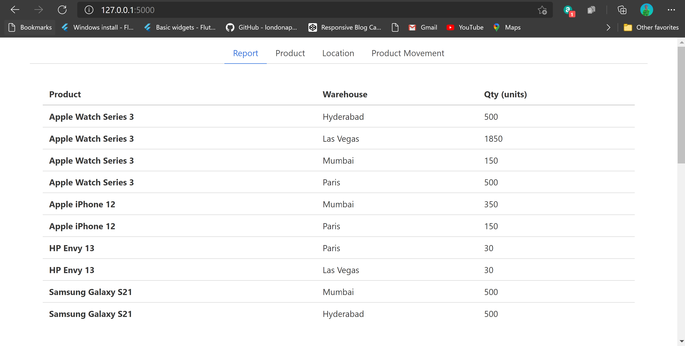
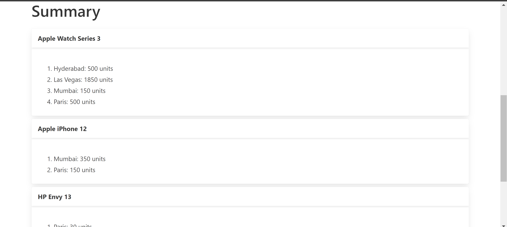
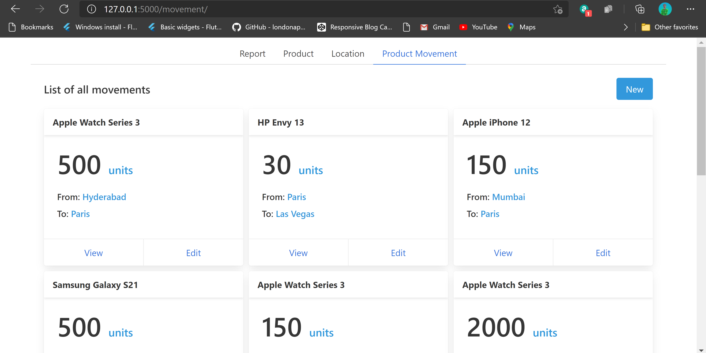
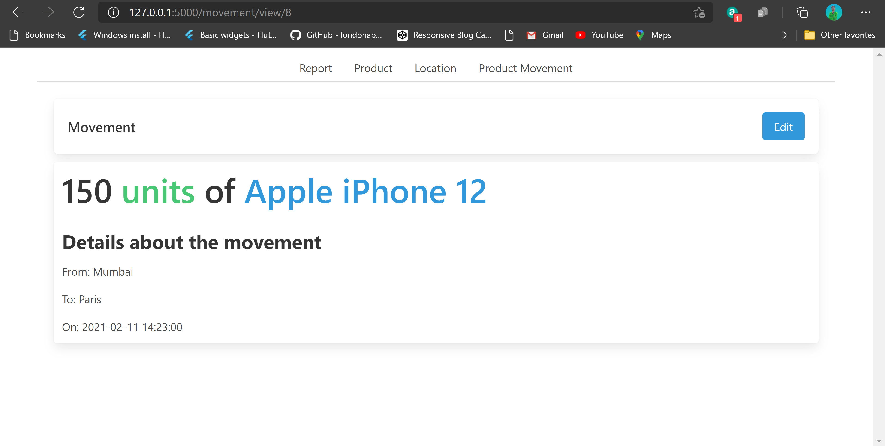
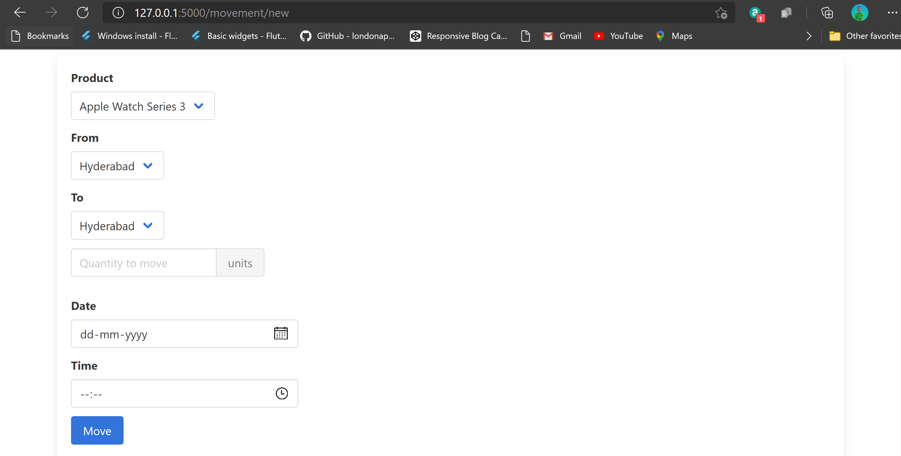
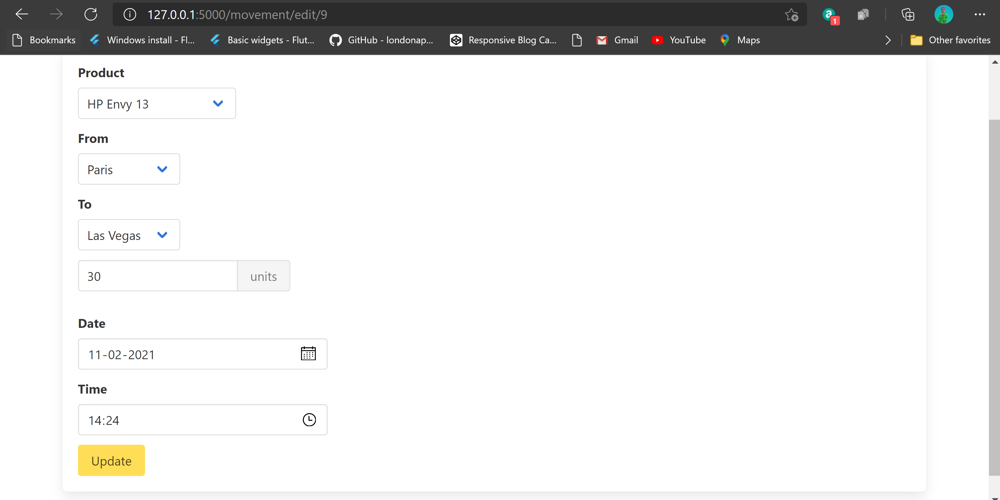
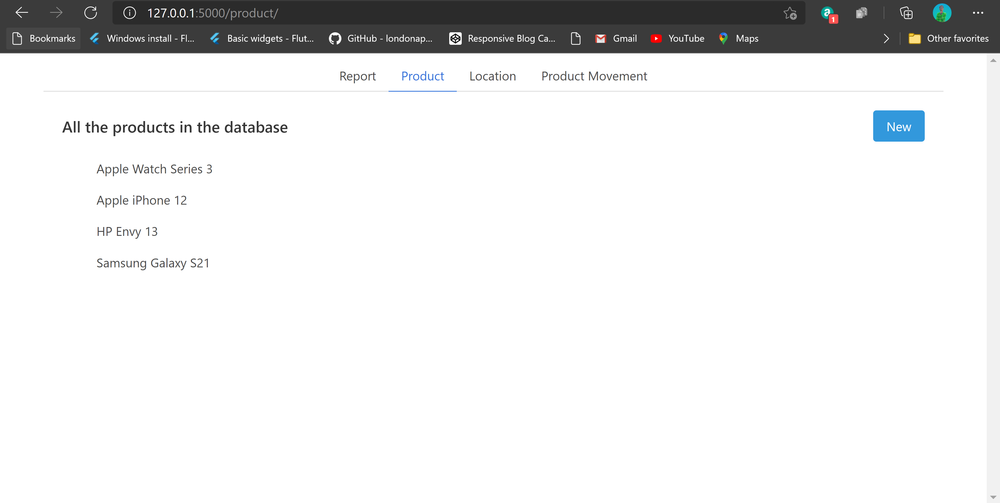
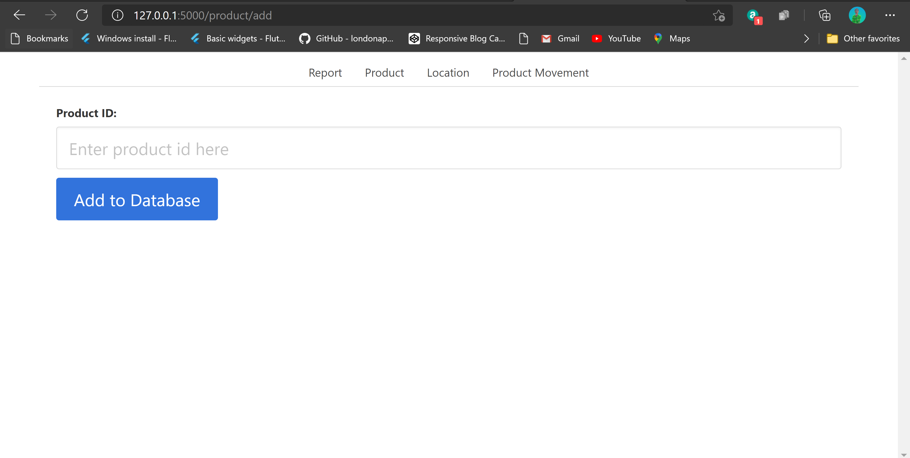
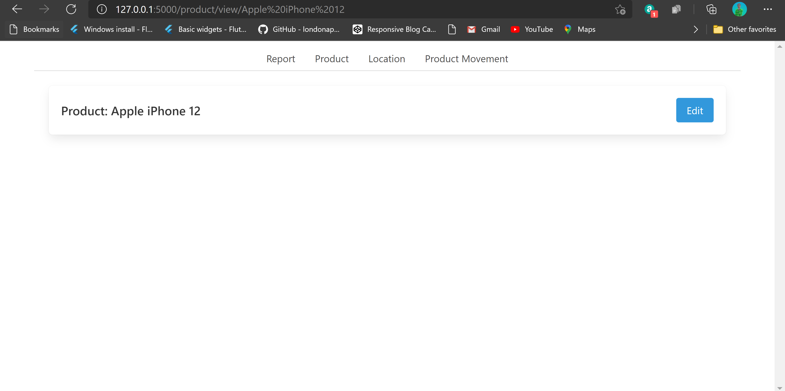
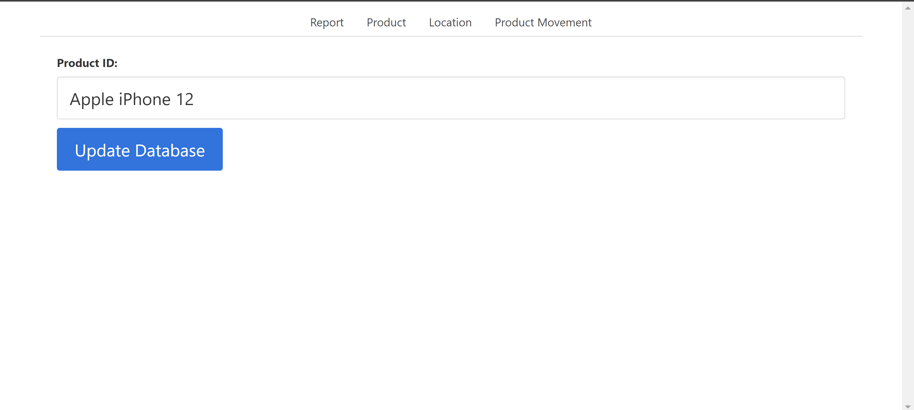

# flask-test

Inventory Management Web Application

## Home Page: Report

## Product Movements List Page

## Single movement view page

## Create new movement page

## Update movement page

## Products List Page

## Products Create From

> Similar for location create

## Single Product view

> Similar for single location view

## Products Update From

> Similar for location update

